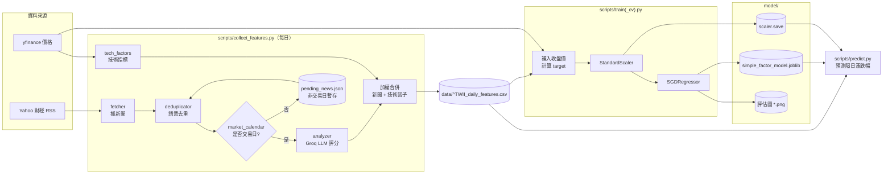
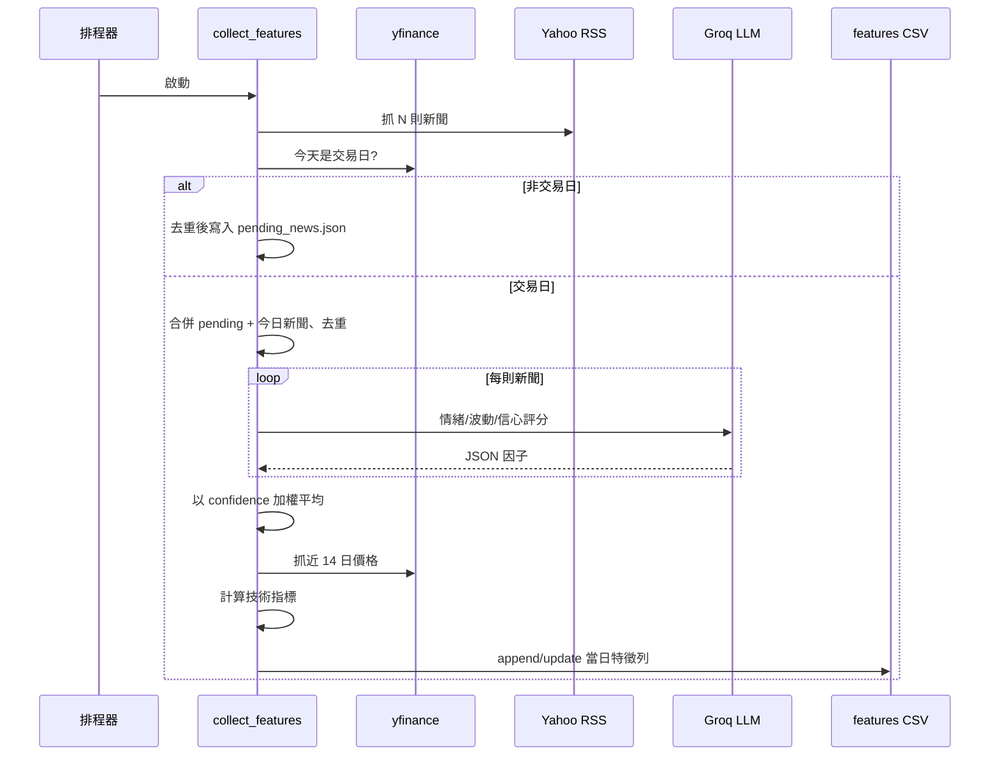

# AI-Stock-Predictor

AI-Stock-Predictor 是一個自動化的台股加權指數（^TWII）預測系統，
結合 **每日新聞情緒分析** 與 **技術指標**，持續累積特徵資料、訓練線性模型，
並輸出隔日漲跌幅預測。

> ⚠️ 本專案僅供學術與研究用途，預測結果不構成任何投資建議。

---

## 功能特色

- 🔍 **新聞抓取**：自動從 Yahoo 財經 RSS 取得最新新聞與內文
- 🧠 **LLM 情緒分析**：透過 Groq（`llama-3.1-8b-instant`）將新聞量化成
  `sentiment_score / volatility_hint / confidence_level / 多空標籤`
- 🧹 **語意去重**：使用 `sentence-transformers` 對標題進行語意比對，過濾重複新聞
- 📈 **技術指標**：動能、5 日波動率、5 日均線、乖離率、RSI
- 🗓️ **交易日感知**：非交易日自動暫存新聞，至下一個交易日合併處理
- 🤖 **線性模型**：以 `SGDRegressor + StandardScaler` 預測隔日漲跌幅，
  並支援 `TimeSeriesSplit` 時序交叉驗證
- 📊 **視覺化**：自動輸出 MSE / R² 對照圖與「預測 vs. 實際」走勢圖

---

## 系統架構



### 每日資料流（單次執行）



---

## 專案結構

```
AI_Stock_Predictor/
├── src/                          # 核心函式庫
│   ├── __init__.py
│   ├── config.py                 # 全域設定（ticker、路徑、API key）
│   ├── fetcher.py                # Yahoo 財經新聞抓取
│   ├── analyzer.py               # Groq LLM 新聞情緒分析
│   ├── deduplicator.py           # 標題語意去重
│   ├── tech_factors.py           # 技術指標計算
│   ├── market_calendar.py        # 交易日判斷
│   └── model.py                  # SimpleFactorModel（訓練、預測、繪圖）
│
├── scripts/                      # CLI 入口
│   ├── collect_features.py       # 每日特徵收集流程
│   ├── train.py                  # 全資料訓練
│   ├── train_cv.py               # TimeSeriesSplit 交叉驗證版訓練
│   └── predict.py                # 載入模型預測隔日漲跌幅
│
├── data/                         # 特徵與暫存資料
│   ├── ^TWII_daily_features.csv
│   └── pending_news.json         # 非交易日暫存新聞
│
├── model/                        # 模型與評估產出
│   ├── simple_factor_model.joblib
│   ├── scaler.save
│   ├── trained_until.txt
│   └── *.png                     # 評估圖
│
├── train_model.py                # 向後相容 shim（舊 joblib pickle 用）
├── requirements.txt
├── pyproject.toml
└── README.md
```

---

## 安裝

需求：**Python 3.13+**（`pyproject.toml` 指定）。如使用 Python 3.10–3.12，
請自行確認套件相容性。

### 1. 取得原始碼

```bash
git clone https://github.com/<your-account>/AI_Stock_Predictor.git
cd AI_Stock_Predictor
```

### 2. 安裝套件

任選其一：

```bash
# 使用 pip
pip install -r requirements.txt

# 或使用 uv（推薦，會直接讀 pyproject.toml）
uv sync
```

### 3. 設定環境變數

在專案根目錄建立 `.env`：

```env
GROQ_API_KEY=sk-...
# 若日後改用 OpenAI 也可一併設定
OPENAI_API_KEY=sk-...
```

> Groq API key 可至 <https://console.groq.com/> 申請。

---

## 使用流程

所有腳本都以 module 形式從專案根目錄執行，確保 `src.*` import 正確。

### 1. 每日資料收集（建議排程執行）

```bash
python -m scripts.collect_features
```

- 交易日：抓取並分析新聞 → 合併技術指標 → 寫入 `data/^TWII_daily_features.csv`
- 非交易日：新聞暫存到 `data/pending_news.json`，下一個交易日合併處理

### 2. 訓練模型

```bash
# 全量訓練（同時更新 features CSV 內的 close 與 target 欄位）
python -m scripts.train

# 或：以 TimeSeriesSplit 進行 5 折時序交叉驗證
python -m scripts.train_cv
```

訓練後會在 `model/` 產出：

- `simple_factor_model.joblib` / `scaler.save`：序列化模型與標準化器
- `trained_until.txt`：最後訓練到的日期
- `mse_comparison.png` / `r2_comparison.png` / `pred_vs_actual.png` 等評估圖

### 3. 預測隔日漲跌幅

```bash
python -m scripts.predict
```

輸出形如 `預測隔日漲跌幅：0.0023`（即 +0.23%）。

---

## 自動化排程

### Linux / macOS（crontab）

```cron
# 每個交易日下午 6 點抓資料
0 18 * * 1-5  cd /path/to/AI_Stock_Predictor && /usr/bin/env python -m scripts.collect_features >> logs/collect.log 2>&1
```

### Windows（工作排程器）

- 程式：`python`
- 引數：`-m scripts.collect_features`
- 起始位置：專案根目錄

---

## 設定檔

主要參數集中在 [`src/config.py`](src/config.py)：

| 變數 | 預設值 | 說明 |
|---|---|---|
| `TICKER` | `^TWII` | yfinance ticker；可改其他指數或個股 |
| `NEWS_COUNT` | `10` | 每次抓取的新聞數 |
| `DATA_DIR` / `MODEL_DIR` | `data` / `model` | 資料與模型存放路徑 |
| `FEATURES_FILE` | `data/{TICKER}_daily_features.csv` | 累積特徵 CSV |
| `PENDING_NEWS_FILE` | `data/pending_news.json` | 非交易日暫存新聞 |
| `GROQ_API_KEY` | 由 `.env` 讀取 | LLM 分析所需 |

---

## 模型說明

特徵欄位（X）：

- **新聞因子**（以各則新聞 `confidence_level` 為權重的加權平均）
  - `sentiment_score`、`volatility_hint`、`confidence_level`、
    `positive_neutral_negative`（+1 / 0 / -1）
- **技術指標**：`tech_momentum_1d`、`tech_volatility_5d`、`tech_ma_5`、
  `tech_bias_5`、`tech_rsi_5`

標籤（y）：

- `target = close[t+1] / close[t] - 1`（隔日漲跌幅）

模型：`SGDRegressor`（線性回歸 + SGD），輸入經 `StandardScaler` 標準化。
基準線（baseline）：以前一日 `target` 直接作為預測值。

---

## 注意事項

- 訓練資料量少時，`SGDRegressor` 容易過擬合或不穩定，請以
  `train_cv.py` 觀察跨折表現再決定是否上線使用。
- 舊版 joblib pickle（`train_model.SimpleFactorModel`）仍可載入，
  根目錄保留 [`train_model.py`](train_model.py) 作為相容 shim；新程式請改
  `from src.model import SimpleFactorModel`。
- 變更 `TICKER` 後，原本的 `^TWII_daily_features.csv` 不會自動沿用，
  系統會以新檔名重新累積資料。
